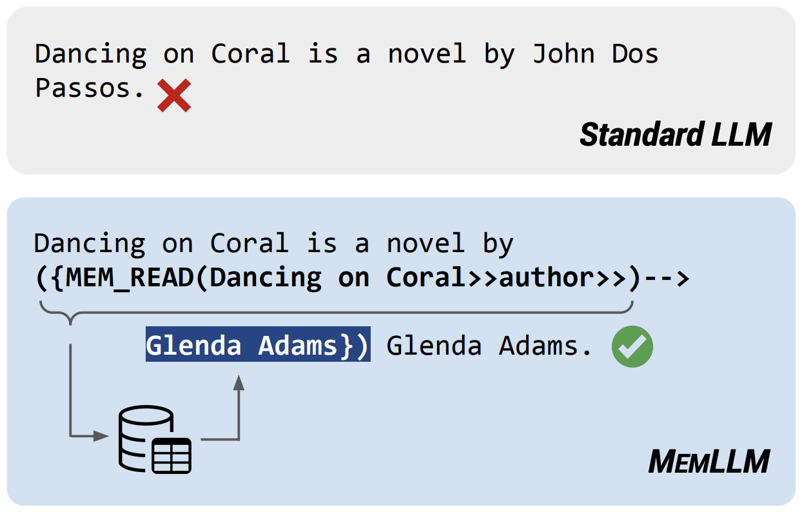

# MemLLM: Finetuning LLMs to Use An Explicit Read-Write Memory

[📃 Paper](https://arxiv.org/abs/2404.11672)

> **Abstract**: While current large language models (LLMs) demonstrate some capabilities in knowledge-intensive tasks, they are limited by relying on their parameters as an implicit storage mechanism. As a result, they struggle with infrequent knowledge and temporal degradation. In addition, the uninterpretable nature of parametric memorization makes it challenging to understand and prevent hallucination. Parametric memory pools and model editing are only partial solutions. Retrieval Augmented Generation (RAG) – though non-parametric – has its own limitations: it lacks structure, complicates interpretability and makes it hard to effectively manage stored knowledge. In this paper, we introduce MemLLM, a novel method of enhancing LLMs by integrating a structured and explicit read-and-write memory module. MemLLM tackles the aforementioned challenges by enabling dynamic interaction with the memory and improving the LLM's capabilities in using stored knowledge. Our experiments indicate that MemLLM enhances the LLM's performance and interpretability, in language modeling in general and knowledge-intensive tasks in particular. We see MemLLM as an important step towards making LLMs more grounded and factual through memory augmentation.



### Gradio demo, Huggingface models and code coming soon...


## Citation
If you found this work useful, please consider citing our paper:
```bibtex
@article{modarressi2024memllm,
  title={MemLLM: Finetuning LLMs to Use An Explicit Read-Write Memory},
  author={Modarressi, Ali and K{\"o}ksal, Abdullatif and Imani, Ayyoob and Fayyaz, Mohsen and Sch{\"u}tze, Hinrich},
  journal={arXiv preprint arXiv:2404.11672},
  year={2024}
}
```

